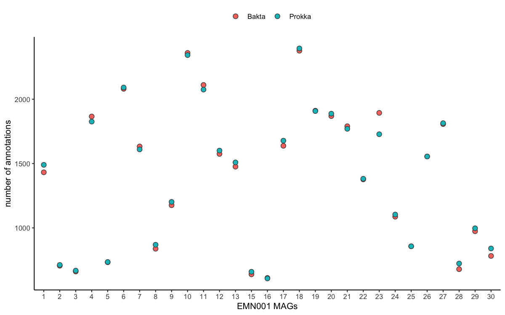
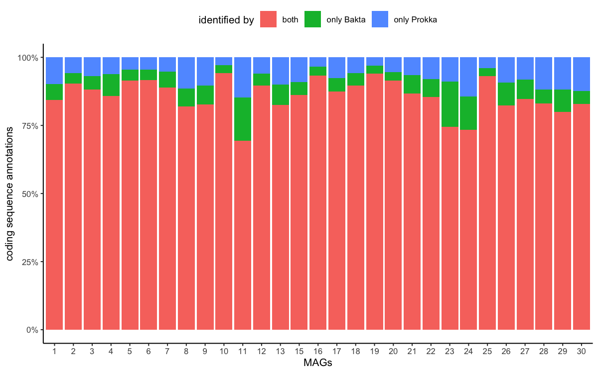

Comparison between Bakta and Prokka for the automatic annotation of
prokaryotic genomes
================
Alex Huebner
Feb 03, 2023

- <a href="#results" id="toc-results">Results</a>
  - <a href="#the-total-number-of-annotations"
    id="toc-the-total-number-of-annotations">The total number of
    annotations</a>
  - <a href="#annotation-of-coding-sequences"
    id="toc-annotation-of-coding-sequences">Annotation of coding
    sequences</a>
  - <a href="#annotation-of-rna-sequences"
    id="toc-annotation-of-rna-sequences">Annotation of RNA sequences</a>
- <a href="#conclusion" id="toc-conclusion">Conclusion</a>
- <a href="#references" id="toc-references">References</a>

In the past ten years, there has been a huge increase in the number of
metagenome-assembled genomes (MAGs) due to improvement in *de novo*
assembly tools, such as MEGAHIT (Li et al. 2015) and metaSPAdes (Nurk et
al. 2017), and the decreasing costs for Illumina short-reads sequencing.
Many of the pipelines available for *de novo* assembly of short-read
sequencing data and subsequent binning of the yielded contigs,
e.g. nf-core/mag (Krakau et al. 2022) or ATLAS (Kieser et al. 2020), are
using the software Prokka (Seemann 2014) to rapidly annotate the MAGs.

Due to its functionality, Prokka has become the de facto standard for
this type of bacterial genome annotation. However, it has not been
developed further in the last years and recently the author of Prokka,
Torsten Seeman, recommended on
[Twitter](https://twitter.com/torstenseemann/status/1565471892840259585?s=20&t=SgsPvhR6e09ByVdXs5PIGg)
to use Bakta (Schwengers et al. 2021) as a successor of Prokka.

In contrast to Prokka, Bakta aims to increase the ability to assign the
newly annotated coding sequences to genes that are available in
reference databases and to improve the export of the annotations,
e.g. by using JSON files. The authors of Bakta performed a single genome
(*E. coli*) benchmark between Bakta and Prokka, and could show that
Bakta had a higher number of proteins with a known function at a similar
run time.

To validate these results on a larger set of genomes and to evaluate the
suitability of the Bakta’s reference databases, I ran Bakta on the 29
MAGs obtained from EMN001 that have been previously annotated using
Prokka and compared the annotation results with each other.

## Results

### The total number of annotations

In total, metaWRAP produced 29 MAGs that comprised 11,266 contigs. These
contigs were provided as input to both Bakta and Prokka and we obtained
8,926 and 9,192 contigs with any type of annotations, respectively.

<!-- -->

**Figure 1**: **Comparison of the total number of annotations per MAG
per method.**

Overall, we observed that the number of annotations per MAG were very
similar between the two methods across all MAGs. There were 8 MAGs for
which Bakta obtained more annotations, 19 for which Prokka obtained more
annotations, and 2 MAGs with the identical number of annotations. The
biggest difference in the number of elements annotated was 166.

However, the type of annotations varied between the two methods (**Table
1**). Next to the types that were shared between the methods (CDS, tRNA,
tmRNA, rRNA), Bakta additionally provided annotations for non-coding RNA
(regions), small open reading frames (sorf), origin of replication
(oriC), and CRISPR.

**Table 1**: **The number of annotations per annotation type.**

|     Type     | Bakta  | Prokka |
|:------------:|:------:|:------:|
|     CDS      | 39,575 | 39,999 |
|     tRNA     |  613   |  595   |
|    tmRNA     |   15   |   15   |
|     rRNA     |   15   |   13   |
| ncRNA-region |  190   |   0    |
|    ncRNA     |   76   |   0    |
|     sorf     |   1    |   0    |
|     oriC     |   1    |   0    |
|    crispr    |   9    |   0    |

### Annotation of coding sequences

The vast majority of annotations were coding sequences (**Table 1**).
These coding sequences are of particular interest to the group because
they are used as input into different screening tools to identify
molecule classes, such as antimicrobial peptides, antibiotic resistance
genes, or biosynthetic gene clusters. Therefore, we combined the
annotations of both Bakta and Prokka and compared which coding sequences
were identified by each program (**Figure 2**).

<!-- -->

**Figure 2**: **The fraction of annotations for coding sequences (CDS)
that were identified by each method.**

Across the 29 MAGs, 85.8% of the CDS were identified by both methods,
while 6.3% and 7.8% were only found by Bakta and Prokka, respectively.
When we look further on whether the detected coding sequences could be
assigned to a known annotations in reference databases, such as COG, GO,
KEGG, PFAM, RFAM, EC, or RefSeq (**Table 2**).

**Table 2**: **The number of reference annotations for the coding
sequences.**

|  detection  | no. of CDS |  both  | no ref. annotation | only Bakta | only Prokka |
|:-----------:|:----------:|:------:|:------------------:|:----------:|:-----------:|
|    both     |   36,701   | 19,300 |       7,365        |   8,976    |    1,060    |
| only Bakta  |   2,874    |   0    |       1,684        |   1,190    |      0      |
| only Prokka |   3,297    |   0    |       3,297        |     0      |      0      |

From the coding sequences that could be detected by either program, more
than half of the CDS could be assigned to a known annotation in a
reference database and only about 20% could not be identified by either
program. Another 25% could only be linked to a reference by Bakta, while
this was only true for about 3% of the CDS for Prokka. This superiority
of Bakta with respect of being able to link CDS to annotations in
reference databases was also apparent when looking at the CDS that were
only detected by one of the two programs. For Prokka, all additionally
found CDS were hypothetical proteins with no link to a reference
annotation. In contrast, Bakta could link more than half of the
additional CDS to a reference.

### Annotation of RNA sequences

Next to coding sequences, there was also the annotation of RNA sequences
that is shared between Bakta and Prokka. There were three types of RNA
sequences that were detected in both programs: tRNAs, tmRNAs, and rRNAs
(**Table 1**). Since the detection of tmRNAs did not differ between the
programs, we will investigate whether there were annotation differences
between the other two categories.

**Table 3**: **Comparison of the overlap of tRNA and rRNA genes between
Bakta and Prokka.**

| RNA type | both | only Bakta | only Prokka |
|:--------:|:----:|:----------:|:-----------:|
|   tRNA   | 428  |    185     |     167     |
|   rRNA   |  1   |     14     |     12      |

For tRNA genes, half of the annotations were shared between Prokka and
Bakta (**Table 3**), but there were about 25% of the tRNA annotations
that were only found by either program. On closer inspection, we could
identified that from these tRNA detected only by one program 121 tRNA
genes were identified to have a match to the annotation from the other
program that fell within three bases (**Table 4**) This was different
for rRNA genes that were almost never shared between the programs
(**Table 3**) and only a small number of the annotations that were only
detected by one program fell within close distance of each other
(**Table 4**).

**Table 4**: **The number of RNA annotations within less than 10 bp from
each other when using Bakta and Prokka.**

| distance btw. annotation \[bp\] | rRNA | tRNA |
|:-------------------------------:|:----:|:----:|
|                1                |  0   | 108  |
|                2                |  0   |  11  |
|                3                |  2   |  2   |
|                4                |  1   |  0   |
|                5                |  2   |  0   |

## Conclusion

Prokka (Seemann 2014) and Bakta (Schwengers et al. 2021) are two
programs that combine a number of specialised tools for the annotation
of microbial sequences. While both programs rely on the prediction of
gene sequences by Prodigal (Hyatt et al. 2010), the individual tools
differ slightly between them. Although both programs have a very similar
number of predicted genetic elements per MAG of EMN001 and many of these
elements were detected by both programs, Bakta was able to link to a
known annotation from a reference database to the predicted sequences
more often. All coding sequences that were only predicted by Prokka were
sequences without any match in the reference database, while Bakta
detected many sequences that were missed by Prokka for which it also
found a match in the reference database. The prediction of tRNAs was
very comparable between the programs, while rRNAs differed strongly.

As the author of Prokka, Torsten Seeman, wrote on Twitter, it seems that
Bakta is the future way to go. Its main advantage that it is able assign
many more genetic elements to reference database and report these
results in a less convoluted way. Furthermore, the expensive conversion
of the results from the GFF file format to the GenBank file format,
which takes up to a few hours when running Prokka on all contigs of a
sample, is optional in Bakta and will save a lot of time.

However, Bakta does not seem to be much more sensitive in detecting and
annotating a higher number of genetic elements compared to Prokka.
Therefore, it will be necessary to run additional sequence search tools,
e.g. based on Hidden Markov Models, with specialised databases to detect
all DNA sequence classes in the samples.

## References

Hyatt, Doug, Gwo-Liang Chen, Philip F. LoCascio, Miriam L. Land, Frank
W. Larimer, and Loren J. Hauser. 2010. “Prodigal: Prokaryotic Gene
Recognition and Translation Initiation Site Identification.” *BMC
Bioinformatics* 11 (1): 119. <https://doi.org/10.1186/1471-2105-11-119>.

Kieser, Silas, Joseph Brown, Evgeny M. Zdobnov, Mirko Trajkovski, and
Lee Ann McCue. 2020. “ATLAS: A Snakemake Workflow for Assembly,
Annotation, and Genomic Binning of Metagenome Sequence Data.” *BMC
Bioinformatics* 21 (1): 257.
<https://doi.org/10.1186/s12859-020-03585-4>.

Krakau, Sabrina, Daniel Straub, Hadrien Gourlé, Gisela Gabernet, and
Sven Nahnsen. 2022. “Nf-Core/Mag: A Best-Practice Pipeline for
Metagenome Hybrid Assembly and Binning.” *NAR Genomics and
Bioinformatics* 4 (1): lqac007.
<https://doi.org/10.1093/nargab/lqac007>.

Li, Dinghua, Chi-Man Liu, Ruibang Luo, Kunihiko Sadakane, and Tak-Wah
Lam. 2015. “MEGAHIT: An Ultra-Fast Single-Node Solution for Large and
Complex Metagenomics Assembly via Succinct de Bruijn Graph.”
*Bioinformatics* 31 (10): 1674–76.
<https://doi.org/10.1093/bioinformatics/btv033>.

Nurk, Sergey, Dmitry Meleshko, Anton Korobeynikov, and Pavel A. Pevzner.
2017. “metaSPAdes: A New Versatile
Metagenomic Assembler.” *Genome Research* 27 (5): 824–34.
<https://doi.org/10.1101/gr.213959.116>.

Schwengers, Oliver, Lukas Jelonek, Marius Alfred Dieckmann, Sebastian
Beyvers, Jochen Blom, and AlexanderYR 2021 Goesmann. 2021. “Bakta: Rapid
and Standardized Annotation of Bacterial Genomes via Alignment-Free
Sequence Identification.” *Microbial Genomics* 7 (11): 000685.
<https://doi.org/10.1099/mgen.0.000685>.

Seemann, Torsten. 2014. “Prokka: Rapid Prokaryotic Genome Annotation.”
*Bioinformatics* 30 (14): 2068–69.
<https://doi.org/10.1093/bioinformatics/btu153>.

