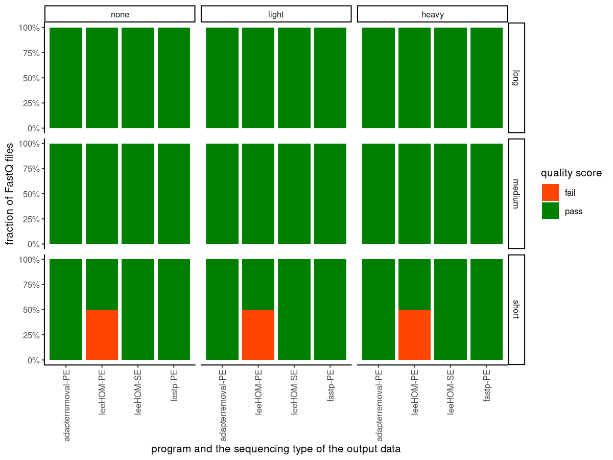
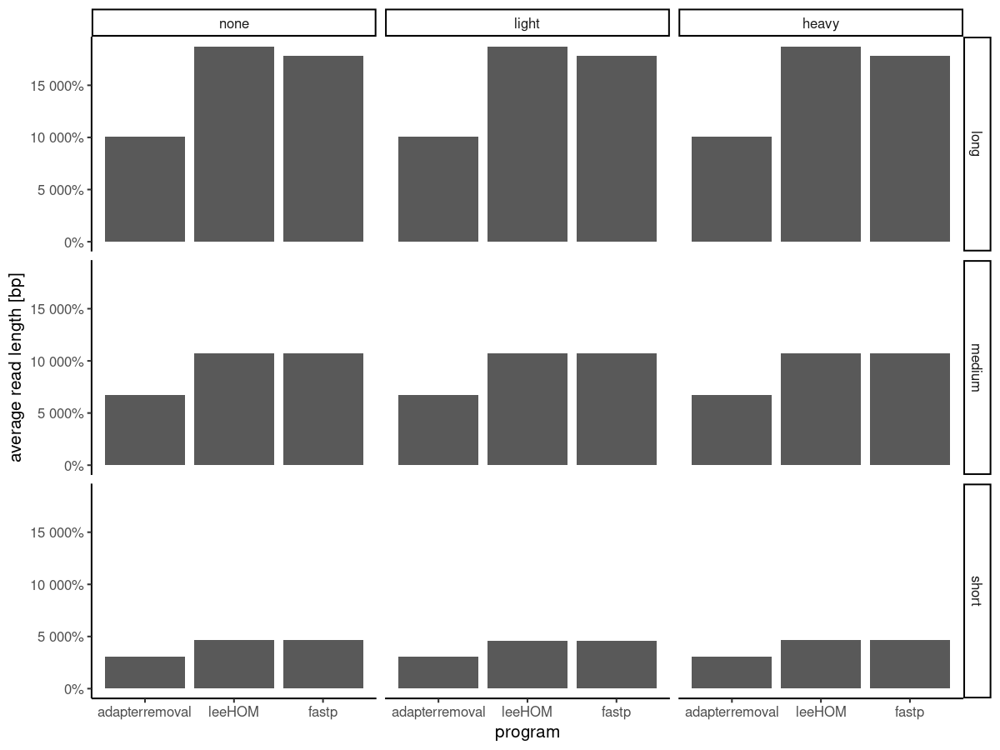

Can fastp replace AR2 or leeHOM for adapter removal and overlapping
merged reads?
================
Alex Huebner
May 05, 2022

-   [Methods](#methods)
-   [Results](#results)
    -   [Efficiency to remove adapter
        sequences](#efficiency-to-remove-adapter-sequences)
    -   [Merging overlapping sequencing pairs into a single
        molecule](#merging-overlapping-sequencing-pairs-into-a-single-molecule)
-   [Conclusion](#conclusion)
-   [References](#references)

The trimming of adapter sequences is an important the first step of
processing Illumina sequencing data, to ensure clean data for subsequent
analyses. Due to the short length of an average DNA molecule, paired-end
sequencing of ancient DNA often leads to an either complete or partial
overlap of the mate sequences. Therefore, specialised adapter removal
tools, such as AdapterRemoval2 (AR2; Schubert, Lindgreen, and Orlando
(2016)) or leeHOM (Renaud, Stenzel, and Kelso 2014) were developed to
allow the merging of these read pairs into a single sequence and tools
with such functionality have become the de-facto standard in the ancient
DNA field.

Both these programs operate on FastQ files. Due to the recent change in
the sequence chemistry of the Illumina sequencers, which introduced
poly-G strings at the end of short DNA sequences, an additional
processing step is required to remove these artefacts from the actual
biological sequences. A tool that is commonly applied for this step is
fastp (Chen et al. 2018) and is a very fast, general purpose FastQ file
manipulation tool. In a recent version, the authors added the option to
trim adapter sequences and merge overlapping read pairs, too. In
addition, fastp offers a suite of extra functionality useful for ancient
DNA data, that are routinely run by researchers using other additional
tools, such as *N* trimming to *in silico* remove ‘damage’ from ends of
reads, or complexity filtering to remove reads with low sequence
diversity reads that provide little information during metagenomic
alignment and slow computational time.

Therefore, the question arose whether it would be necessary to still run
the specialised adapter removal programs or whether fastp can replace
these and save additional processing step(s). In the following, I will
compare the three programs, AdapterRemoval2, leeHOM, and fastp with each
other on a simulated set of sequencing data with variation in the amount
of ancient DNA damage and average DNA molecule length.

# Methods

A [snakemake
pipeline](https://github.com/paleobiotechnology/tiny_projects/commit/ac19265c504c146303b13ff287394c49913d795d)
was used to run each tool with each dataset. For reference, the commands
executed for each tool can be seen below.

``` bash
## AdapterRemoval
AdapterRemoval --basename {params.prefix} \
                   --file1 {params.pe1} \
                   --file2 {params.pe2} \
                   --trimns \
                   --trimqualities \
                   --minquality 20 \
                   --minlength 30 \
                   --threads {threads} \
                   --qualitybase 33 \
                   --adapter1 {params.forward_adapter} \
                   --adapter2 {params.reverse_adapter} \
                   {params.collapse} \
                   --settings {log}
## LeeHOM
leeHom -f {params.forward_adapter} \
       -s {params.reverse_adapter} \
       -t {threads} \
       -fq1 {params.pe1} \
       -fq2 {params.pe2} \
       -fqo {params.prefix} \
       --log {log} \
       {params.collapse}
               
## fastp
fastp --in1 {params.pe1} \
      --in2 {params.pe2} \
      --out1 {params.prefix}_1.fastq.gz \
      --out2 {params.prefix}_2.fastq.gz \
      {params.collapse} \
      --compression 4 \
      --adapter_sequence {params.forward_adapter} \
      --adapter_sequence_r2 {params.reverse_adapter} \
      --trim_poly_g \
      --json {log} \
      --html /dev/null
```

Where `params.collapse` provides the corresponding option to turn on
read-merging for each tool.

Additional parameters for AdapterRemoval2 represent commonly used
parameters in ancient DNA, in particular used in the pipeline
[nf-core/eager](https://nf-co.re/eager).

# Results

To evaluate the performance of the different tools, I made use of a
previously simulated dataset (for details see
<https://github.com/alexhbnr/effect_aDNAdamage_denovoassembly>) that
consisted of 50 million DNA sequences that were generated from 30
microbial species commonly found in dental calculus as either commensals
or contaminants. The samples differed in average DNA molecule length
(short, medium, long) and amount of observed ancient DNA damage (none,
light, heavy).

I tested each of the three programs across these nine samples on default
or established aDNA-specific settings, enabling or disabling the
collapse of overlapping read pairs, respectively. I summarised the
performance of the adapter removal using FastQC (Andrews and others
2010) and summarised all reports into summary tables using MultiQC
(Ewels et al. 2016).

    ## ── Attaching packages ─────────────────────────────────────── tidyverse 1.3.1 ──

    ## ✓ ggplot2 3.3.5     ✓ purrr   0.3.4
    ## ✓ tibble  3.1.4     ✓ dplyr   1.0.7
    ## ✓ tidyr   1.1.3     ✓ stringr 1.4.0
    ## ✓ readr   2.0.1     ✓ forcats 0.5.1

    ## ── Conflicts ────────────────────────────────────────── tidyverse_conflicts() ──
    ## x dplyr::between()   masks data.table::between()
    ## x dplyr::filter()    masks stats::filter()
    ## x dplyr::first()     masks data.table::first()
    ## x dplyr::lag()       masks stats::lag()
    ## x dplyr::last()      masks data.table::last()
    ## x purrr::transpose() masks data.table::transpose()

## Efficiency to remove adapter sequences

First and foremost, the importance of the adapter removal step is to
remove technical adapter sequences from the sequencing data as they may
interfere with the analysis of the biological signal in these data.
Therefore, I first evaluated how well the different software remove
adapter sequences efficiently, and whether overrepresented adapter
sequences were observed in the data.

The first metric to evaluate is whether the respective sequencing data
of the samples still contains sequences that are likely derived from
Illumina adapter sequences. FastQC iterates over the sequencing data
searching for such sequence motifs and reports a sample either as pass,
warn, or fail. Since FastQC is running its analyses per sequencing data
file, I further summarised this metric across all output files of a
sample.

I compared the results when either with (**Figure 2**) or without
(**Figure 1**) merging of overlapping read pairs was performed. Without
merging the read pairs, by default both AdapterRemoval2 and fastp
returned one output file per input file (in total two files), while
leeHOM additionally created a single-end file in case only one mate of
the read pairs passed the required quality.

For all nine samples, under default parameters, both AdapterRemoval2 and
fastp managed to pass the adapter content test of FastQC, i.e. no
adapter sequence motifs were observed. For leeHOM, there were no adapter
sequencing motifs observed in the singleton data but the forward mate of
the read pairs failed the test when the underlying DNA molecule length
distribution was short. Such a DNA molecule length distribution is
characteristic for poorly preserved ancient DNA samples and is
particularly worrying, when planning to use leeHOM to remove adapter
sequences, particular prior to *de novo* assembly.

<!-- -->

**Figure 1**: **Overview of the results of the analysis for the absence
of Illumina adapter sequence motifs in the sequencing data after the
adapter removal without merging overlapping reads.** The fraction of
FastQ files was dependent on the number of files reported per program:
both AdapterRemoval2 and fastp exported each one file per read mate,
while leeHOM exported additionally singleton for which one of the read
mates did not fulfil the quality criteria.

When enabling merging of overlapping reads, the overlapping and
subsequently merged sequencing data exported by all three programs
passed the adapter content test of FastQC. However, for the read pairs
that could not be overlapped we observed differences between the
programs. While fastp had no adapter sequence motifs in the remaining
paired data independent of the underlying DNA molecule length
distribution, we observed issues for both AdapterRemoval2 and leeHOM,
with the data with either medium or short read length distribution.

<!-- -->

**Figure 2**: **Overview of the results of the analysis for the absence
of Illumina adapter sequence motifs in the sequencing data after the
adapter removal with merging overlapping reads.** The fraction of FastQ
files was dependent on the number of files reported per program.

None of the programs retained any other overrepresented sequences and
all three programs raised either warnings or even failed the per-base
sequence content test of FastQC, when the underlying DNA molecule
distribution was short, suggesting that this is rather a problem with
the underlying FastQC test rather than something that these programs
influenced.

In summary, fastp performed the most consistent across all data sets
regarding the removal of adapter sequences. AdapterRemoval2 only seemed
to have issues regarding removing adapters in non-merged sequence pairs
when the DNA molecule length distribution was shorter, leeHOM seemed to
suffer in general with removing adapter sequences in sequences that were
not merged into a single one.

## Merging overlapping sequencing pairs into a single molecule

Ancient DNA molecules can be characterised by their on-average short
length that often is shorter than the nominal sequencing length of the
sequencing kit. For such cases, the sequences obtained from paired-end
sequencing overlap in the middle and can be merged into a single, longer
DNA molecule sequence. This is commonly performed for all type of
analyses in ancient DNA with the exception of *de novo* assembly, which
either requires or strongly benefits from paired-end sequencing data.
Therefore, I additionally will evaluate the performance of merging
overlapping paired reads.

The behaviour of merging of overlapping read pairs can usually be
influenced by specifying the required overlap of the two paired reads.
By default, fastp requires an overlap of 30 bp, AdapterRemoval2 of 11
bp, and for leeHOM this parameter is not accessible via the
command-line. The effect of this can be observed when comparing the
fraction of merged read pairs per program (**Figure 3**).
AdapterRemoval2 had the highest fraction of successfully merge reads,
followed by leeHOM and fastp, however, the differences were relatively
small, particularly for the samples simulated from a medium or short DNA
molecule length distribution.

<!-- -->

**Figure 3**: **Overview of the fraction of merged overlapping read
pairs per program.**

However, while the number of merged read pairs was highest for
AdapterRemoval2, the average read length of the merged molecules was
much shorter than leeHOM and fastp, which returned almost identical
sequencing length (**Figure 4**). This suggests that enabling the
quality trimming options `--trimns --trimqualities` of AdapterRemoval2,
that we enable by default in many ancient DNA projects, substantially
trimmed the read pairs while the other two programs do not perform such
extensive quality trimming by default.

<!-- -->

**Figure 4**: **Average read length of merged overlapping read pairs per
program.**

# Conclusion

To evaluate whether the program fastp is a suitable alternative for
trimming Illumina adapter sequences from sequencing data, I compared it
to two standard adapter removal tools, AdapterRemoval2 and leeHOM. I
selected a set of simulated sequencing data with different
characteristics regarding the DNA molecule length and the amount of
ancient DNA damage and ran all programs with parameters commonly used in
the field of ancient DNA.

fastp was able to remove adapter sequences efficiently and it was the
only program that could remove all adapter sequence motifs across all
datasets and could thus pass the adapter content test of FastQC.
Furthermore, it is able to efficiently merge overlapping read pairs into
a single sequence, and likely with comparative results to
AdapterRemoval2 with tweaking of parameters.

Overall, due fastp’s efficiency and the additional in-built
functionality provided, the analyses presented here suggest that it
could be used to replace the dedicated adapter trimming tools,
AdapterRemoval2 and leeHOM.

# References

<div id="refs" class="references csl-bib-body hanging-indent">

<div id="ref-Andrews2010" class="csl-entry">

Andrews, Simon, and others. 2010. “FastQC: A Quality Control Tool for
High Throughput Sequence Data.” Babraham Bioinformatics, Babraham
Institute, Cambridge, United Kingdom.

</div>

<div id="ref-Chen2018" class="csl-entry">

Chen, Shifu, Yanqing Zhou, Yaru Chen, and Jia Gu. 2018. “Fastp: An
Ultra-Fast All-in-One FASTQ Preprocessor.” *Bioinformatics* 34 (17):
i884–90. <https://doi.org/10.1093/bioinformatics/bty560>.

</div>

<div id="ref-Ewels2016" class="csl-entry">

Ewels, Philip, Måns Magnusson, Sverker Lundin, and Max Käller. 2016.
“MultiQC: Summarize Analysis Results for Multiple Tools and Samples in a
Single Report.” *Bioinformatics* 32 (19): 3047–48.
<https://doi.org/10.1093/bioinformatics/btw354>.

</div>

<div id="ref-RenaudLeeHOM2014" class="csl-entry">

Renaud, Gabriel, Udo Stenzel, and Janet Kelso. 2014. “<span
class="nocase">leeHom</span>: Adaptor Trimming and Merging for Illumina
Sequencing Reads.” *Nucleic Acids Research* 42 (18): e141.
<https://doi.org/10.1093/nar/gku699>.

</div>

<div id="ref-Schubert2016" class="csl-entry">

Schubert, Mikkel, Stinus Lindgreen, and Ludovic Orlando. 2016.
“AdapterRemoval V2: Rapid Adapter Trimming, Identification, and Read
Merging.” *BMC Research Notes* 9 (1): 88.
<https://doi.org/10.1186/s13104-016-1900-2>.

</div>

</div>
